# Effects of prosody on the perception of agreement
gratton  
June 14, 2017  

# Summary
Though there has been an interest in the prosody of agreement, much of the work has simplified the analyses by focusing only on utterance final contours – despite phonetics cues early on in the utterance indexing social meanings – and by reducing the interactional meaning to a binary distinction between agreeing and disagreeing. My belief is that variation in prosodic cues can be employed to produce various stances, alignments, and positionalities within interactions. As such, my research focus here is to begin unpacking the social meanings tied to the utterance final prosodic contours of ambiguous agreement utterances. The current study address the existing literature by replicating results focused solely on utterance final prosody as a source of interactional meaning. Further research will test the potential of utterance initial phonetic cues indicating interactional meaning and attempt to tease apart the interrelated meanings of evaluation, agreement and positionality.

# Introduction: The present experiement

## Purpose
This experiment examines the effects of prosodic contour on listener perception of interactional factors. The primary concern is the effect of affirmative and contrastive prosodic contours on the degree to which listeners perceive agreement between interlocutors. These effects are tested in a controlled way, by limiting the appearance of such contours to a particular type of assessment sequence: token agreement.

## Background
### Assessment sequences
An assessment sequence is an typically dyadic interaction in which one speaker’s evaluative assessment of a stance object is engaged with by their interlocutor, such as the example in (1). The utterances composing such interactions are generally referred to as the first assessment and the second assessment turns.  

(1)	S1	That cake was delicious!  
		S2	Yeah, it was pretty good.  
		
It is the second assessment turn which is the focus of this research, as it is an important site of linguistic variation at which a speaker may express not only evaluation of the given stance object but also alignment with their interlocutor.  
The concept of alignment, as described by DuBois (2007), constructs speaker stance as a triangle. In this view the speaker and their interlocutor represent two points of the triangle and each may produce stances towards a shared stance object, representing the third point. In this way they not only position themselves in relation to the object of their stance but their respective stances also orient them to each other, thus variably aligning them with their interlocutor. Though the nature of this alignment can vary a typical form of alignment is agreement.  
The example in (1) highlights this particular type of alignment. Here speaker 2’s stance towards the stance object, the cake, expresses their marginally positive evaluation, pretty good (*pretty* here downplays the adjective it’s paired with), and thus indicates their marginally agreement with speaker 1: they do not wholly agree with the assessment that the cake is delicious, nor do they wholly disagree since the cake is somewhat good.  

### The phonetics of agreement
Research focusing on second assessments as a site for agreement have taken a fairly binary approach. Testing for prosodic variation, they have found that affirmative utterances (expressing agreement) tend to have a contour of H\* L-L% (Dennison and Schafer 2010; Kurumada et al. 2012) and contrastive utterances (expressing disagreement) tend to have a contour of L+H\* L-H% (Dennison and Schafer 2010; Kurumada et al. 2012; Ogden 2006). Most have focused on utterance final prosody as the important site for agreement perception (though see Dennison and Schafer 2010 for a more holistic approach). Both lexical and prosodic cues can be employed to create four main types of second assessments: strong agreement, ‘same’ agreement, downgrading, and strong disagreement. An example of this is shown in (2).  

(2)	S1	That was a great movie!  
		S2	It was amazing!		    (strong agreement)  
		S2	Yeah, it was great.		(‘same’ agreement)  
		S2	It was okay.			    (downgrading)  
		S2	No, it was boring.		(strong disagreement)  
		
A particularly interesting site of variation is found in second assessments that employ repetition of the evaluation. These are lexically similarly to ‘same’ agreement utterances, though the prosodic contour need not ‘match.’ That is to say, though expressing agreement lexically the utterance itself may express disagreement by way of the contrastive (disagreeing) contour L-H%  (Ogden 2006: 1768). In this way the second assessment is nearly an instance of token agreement.  
Though the literature addressing this intersection of prosody and pragmatics has been satisfied to view such instances of token agreement in a simple and binary way, I believe that there is more at work than merely disagreement. In any given turn a speaker may express diverse types of stances towards a stance object and diverse alignments towards their interlocutor, as well as their position in regards to their act of disagreement itself. In addition, the focus of utterance final contours is a gross oversimplification of agreement prosody. Some aspects of these various interactional meanings are apparent in the speech stream long before the utterance final contour (e.g., disagreement: Dennison and Schafer 2010).   
For these reasons, I am proposing a series of (perception) experiments aiming to unpack both the various forms of prosodic contours tied to token agreement and the social meanings tied to them. First, I will address the current literature by replicating results focused on utterance final prosody as a source of (dis)agreement. Second, I will test potential utterance initial phonetic cues and assess their ties to interactional meanings. Third, I will attempt to tease apart the interrelated meanings of evaluation, agreement and positionality, as they are employed in prosodic contours.

## Research questions
Two main research questions are being addressed by this experiment:

1. Does variation in prosodic contour (from affirmative to contrastive) lead to a change in the utterances perceived agreement?
2. Does a contrastive prosodic contour indicate more than just disagreement, influencing other interactional meanings?

## Expectations
I predict, inline with previous studies, that overall listeners will perceive the critical trials with affirmative (L-L%) contour as expressing a greater degree of agreement and the critical trials with contrastive (L-H%) contour as expressing a greater degree of disagreement.  
I also make a prediction that positive semantic constructs with affirmative (L-L%) contour will be perceived as fairly positive evaluations, that positive constructs with contrastive (L-H%) contour will be perceived as fairly negative evaluations, that negative constructs with affirmative (L-L%) contour will be perceived as fairly negative evaluations, but that negative constructs with contrastive (L-H%) contour will be perceived as neutral or only somewhat negative evaluations. This prediction is based on the difference between contradicting negative vs. positive statements. This predicted interaction is shown here:

Contour/Polarity          |Positive |Negative
------------|---------|--------
Affirmative Contour |+eval   |-eval
Contrastive Contour |-eval   |+eval


# The experiment

## Methods
### Participants
This perception study employed Amazon's Mechanical Turk (www.MTurk.com). 30 subjects were recruited to take the experiment, which took approximately 6 minutes to complete. They were compensated 1.20$ for their time. 2 participants were excluded from analysis as they failed at least one attention check in the experiment. All listeners were paid regardless of their performance.

### Structure
The pilot experiment replicates previous studies by testing the perception of lexically ambiguous assessment sequences, given utterance final prosodic variation. I will have subjects listen to dyadic assessment sequences and rate the degree to which they feel that the second speaker agrees/disagrees with the first speaker, that the second speaker likes/dislikes the stance object, that the second speaker is happy/unhappy, and that the second speaker is friendly/unfriendly. For optimal similarity these four evaluation are situated as polar ends of a scale.  

### Materials
The stimuli consist of twelve auditory dyadic interactions, six critical and eight filler, in the style of assessment pairs. The first assessment utterance consists of Speaker A’s evaluation of a stance object object, either positive (3 critical, 4 filler) or negative (3 critical, 4 filler). The critical trials have second assessment utterances that relays Speaker B’s reply by repeating the evaluative word used in the first assessment. An example of this is shown in (3):

(3)	S1	That cake was good  
		S2	It was good

The second assessment utterances are presented to listeners with either affirmative (L-L%) or contrastive (L-H%) utterance final contours. These are randomized so that each listeners will hear three affirmative contours and three contrastive ones. The filler trails have second assessment utterances that contain various lexical assessments (half positive and half negative) and are all presented with neutral contours. The complete list of stimuli is replicated in the appendix.

All stimuli were created by eliciting natural (i.e., non-manipulated) speech. Two speakers were asked to record on speaker's lines, repeating each utterance multiple times. All utterances were examined visually in Praat (Boersma & Weenink 2011) for the preferred prosodic contours:

- All of Speaker 1's lines were ideally fairly neutral prosodically but not 'flat' sounding, aiming for some engagement that was not emphatic.
- Filler lines for Speaker 2 had neutral prosody, regardless of 'flatness'. This was to make them as similar as possible to critical trials.
- Critical lines for Speaker 2 were created by splicing together the with part of a neutral prosody utterance with the desired utterance final contour. First, neutral prosodic contours were elicited for the whole utterance, to be used as the carrier phrase. Second, both affirmative and contrastive contours were elicited for the whole utterance. From the various iterations produced, the contours which most closely matched those represented in the existing literature were selected. From these, the final contours (i.e., the final adjectives) were extracted and inserted into the carrier phrase. In this way, the utterance initial phonetics were the same for both the affirmative and contrastive stimuli for the same topic.

## Results
### Organizing the data
First, we want to restrict the data to only those from critical trials (where the prosodic contour of the utterance was manipulated). And we want to remove the levels that are no longer required (8 topics, neutral prosody, and a few adjectives).


Also, before continuing, it is important to explore the data for potential confounds.

#### Confounds

##### Adjective variability

The particular adjective being evaluated influenced the perception of agreement, evaluation, friendliness and happiness.

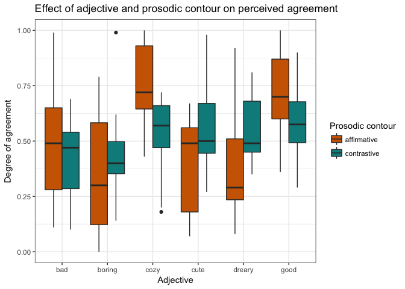

We find that not all adjectives pattern as expected. While the positive adjectives **cozy** and **good** are perceived as showing less agreement when uttered with a contrastive contour, the positive adjective **cute** shows no such change.

Similarly, while the negative adjectives **boring** and **dreary** are perceived as showing more agreement when uttered with a contrastive contour, the negative adjective **bad** shows no such change.

##### Subject variability

There is a large amount of variability between subjects, as well as differing degrees of intra-subject variability.

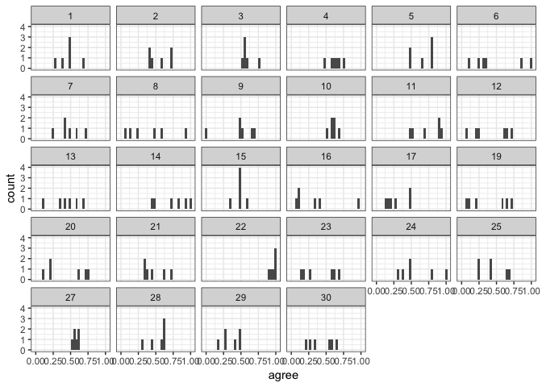

Because of this variability, it may be important to exclude some subjects. Plotting their perception of agreement by prosodic contour highlights some of the more invariable subjects: 22, 27, and 10.

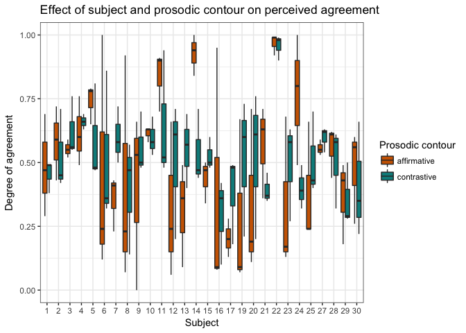

In addition to seeing the different variability within subjects, we can also note an interesting directionality pattern. The respondents differ greatly on their perception of agreement given prosodic contours, with roughly half finding affirmative contours to be, on average, indicative of less agreement.

This inter-subject variability is not just notable in their assessments of prosodic contours, but also their assessments of adjective polarity:

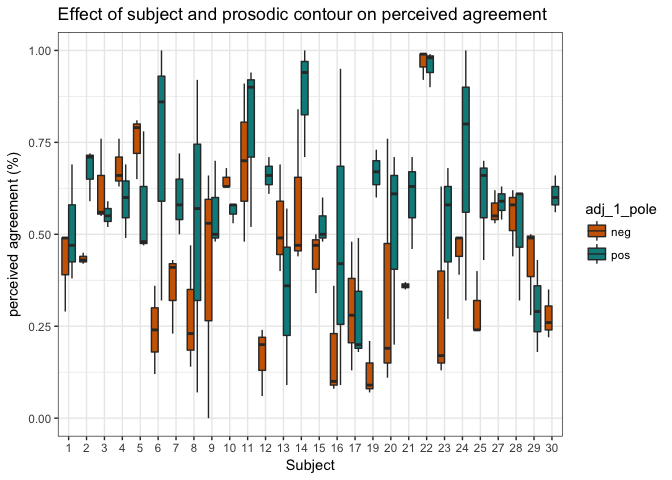

This means that across subjects, some found negative adjectives to be more indicative of agreement and others found the same polarity to be indicative of disagreement.

Apart from understanding the degree of variability between subjects, we are also able to to glimpse the degree of intra-subject variability. For example, in the above graphs we see that subject 22 feels that both types of prosodic contours and both types of adjectives are equally indicative of high agreement. While this seems to point to an unreliable subject, examining the responses to other interactional factors reveals that these same respondents may be reliable, and are simply not variable when it comes to perceived agreement (see graph below of perceived happiness).
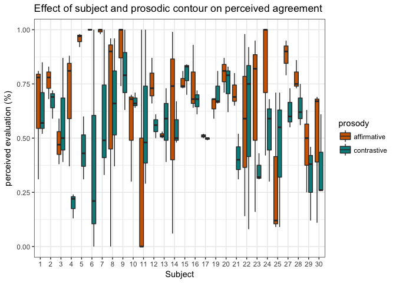

So, should we exclude some subjects form the data set? And if so, what would be a principle way of doing?

One potential means for exclusion would be to remove participants whose variability fell below a particular threshold relative to other subjects. One such threshold is the bottom 5th percentile. Research seeking to remove outliers on both ends would also remove those above the top 95th percentile. However, in this case that degree of variability is not problematic, as it is only indicative of a listener who is more perceptive of varying degrees of agreement.

Visually, we can examine which subjects fall below the 5th percentile, as well as those who are the most variable and those closer to the mean. Below is a graph of listener's standard deviation for responses to agreement. Those whose variability falls below the 5th percentile are subject 22 and 27.

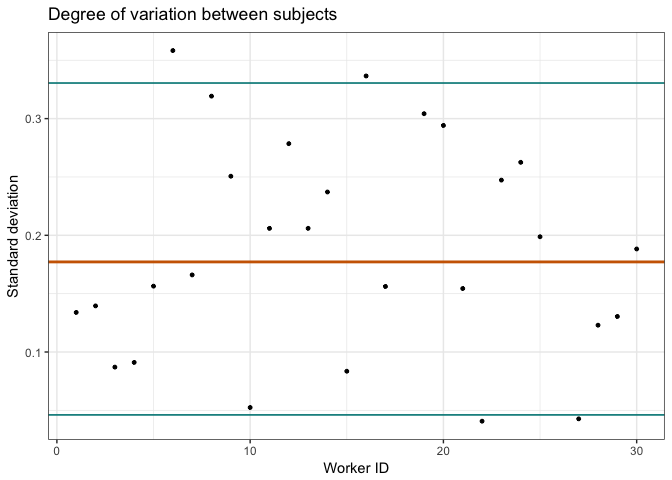

However, as we saw above, though 22 is invariable with responses to agreement, they do show considerable variation in responses to other social meaning prompts. Since this indicates that they, and others like them, may not be entirely uncooperative subjects, we would need a means of exclusion that take all responses into consideration.

One possibility would examining subject variability across all four interactional assessments. However these four tasks had very different expectations of variability. The stimuli were expressly constructed to expect variability in *agreement* and *evaluation*, but not necessarily in friendliness or happiness. The latter are more an artifact of the speaker's persona in a given interaction and was not explicitly manipulate. This means that listeners may perceive Speaker 2 as being, in general, a friendly or happy person, regardless of interactional specifications. As such, the prior assessments ought to be evaluated separately.

By enforcing a lower bound of the 5th percentile for the variability in responses to both agreement and evaluation we find that only one subject is removed: 27. This respondent had the following standard deviations:


```
##   workerid   SD_agree    SD_like
## 1       27 0.04273952 0.05307228
```

Removing them from the model does not significant effect the results (see both models in the appendix). As such, I have chosen to retain subject 27 in the present analysis, despite their invariance.

#### Representation in the data
To be sure that we recieved sufficient responses for each pairing of factors, we can take a look at the distribution of the data in two ways:

+ by prosodic contour (affirmative and contrastive) and adjective valence (positive and negative)


```
##              
##               neg pos
##   affirmative  46  38
##   contrastive  38  46
```

+ by prosodic contour (affirmative and contrastive) and topic


```
##         
##          affirmative contrastive
##   bad             17          11
##   boring          14          14
##   cozy            11          17
##   cute            13          15
##   dreary          15          13
##   good            14          14
```

We have roughly equal representation in all quadrants, so we're good to go!

## Exploring Agreement
First, let's plot the overall distribution of agreement responses:

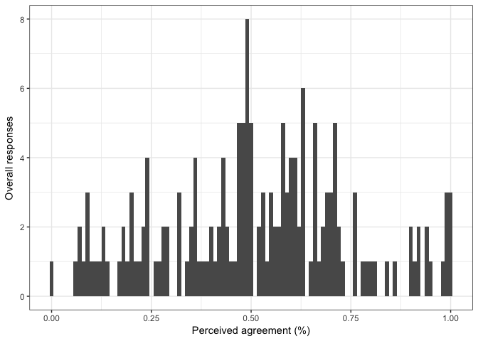

We see that the histogram is normally distributed around 0.5, even though we may have expected to see a bimodal distribution pulled towards 'agree' (above 0.5) and 'disagree' (below 0.5). This suggests that these two prosodic contours do not elicit clear meanings of "agree" or "disagree", and that instead that there exists some variability related to adjective, valence, speaker, listeners or potentially other interactional meanings.

We can begin to unpack some of this by examining the model which best represents the data. This model is fit to a centred dataset due to strong correlations between factors. The examination of this correlations is found in the appendix.


```
## Linear mixed model fit by maximum likelihood  ['lmerMod']
## Formula: agree ~ cprosody * cadj_1_pole + clike + cfriendly + chappy +  
##     (1 + cprosody | workerid) + (1 | adj_1)
##    Data: centered
## 
##      AIC      BIC   logLik deviance df.resid 
##    -67.3    -29.8     45.7    -91.3      156 
## 
## Scaled residuals: 
##      Min       1Q   Median       3Q      Max 
## -2.24974 -0.62198 -0.02567  0.66076  2.75479 
## 
## Random effects:
##  Groups   Name        Variance  Std.Dev. Corr 
##  workerid (Intercept) 0.0129910 0.11398       
##           cprosody    0.0054629 0.07391  -1.00
##  adj_1    (Intercept) 0.0006802 0.02608       
##  Residual             0.0262213 0.16193       
## Number of obs: 168, groups:  workerid, 28; adj_1, 6
## 
## Fixed effects:
##                        Estimate Std. Error t value
## (Intercept)           0.5172554  0.0271122  19.078
## cprosody              0.0444514  0.0300376   1.480
## cadj_1_pole           0.1130122  0.0343873   3.286
## clike                 0.3064922  0.0592855   5.170
## cfriendly             0.0008094  0.0628349   0.013
## chappy                0.1133536  0.0618056   1.834
## cprosody:cadj_1_pole -0.1247270  0.0540199  -2.309
## 
## Correlation of Fixed Effects:
##             (Intr) cprsdy cdj_1_ clike  cfrndl chappy
## cprosody    -0.370                                   
## cadj_1_pole  0.003 -0.090                            
## clike       -0.001  0.159 -0.058                     
## cfriendly   -0.005 -0.079 -0.213 -0.235              
## chappy       0.001  0.231 -0.029 -0.016 -0.391       
## cprsdy:c_1_ -0.047  0.012 -0.066  0.029  0.113 -0.012
```

As we see from this model, prosodic contour alone is not a significant predictor of perceived agreement.

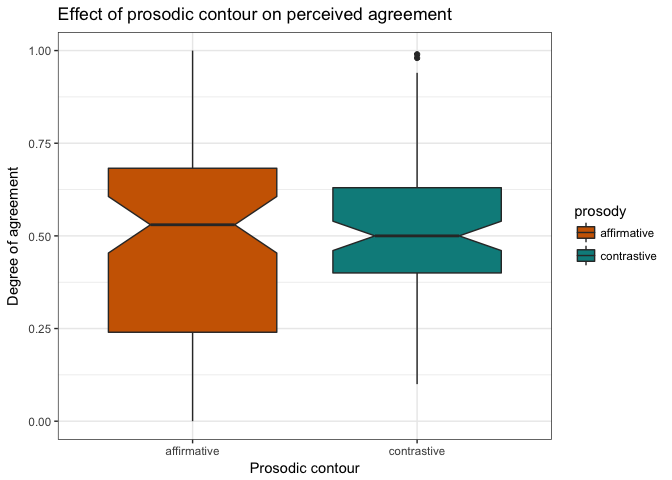

Instead, prosodic contour in interaction with adjective valence predicts the degree of perceived agreement, and adjective valence is  itself a main effect.

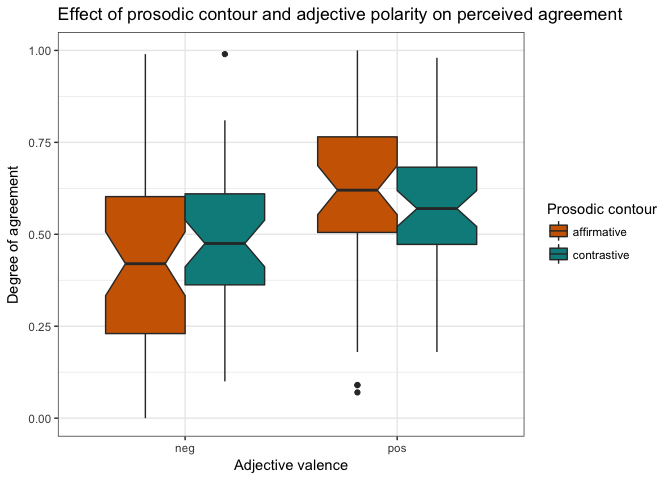

We see that there is an interaction, such that:

+ positive adjectives with contrastive prosody are perceived as showing **less agreement** than those with affirmative prosody

+ negative adjectives with contrastive prosody are perceived as showing **more agreement** than those with affirmative prosody

Apart from agreement, evaluation is by far the most interesting interactional assessment in these results. This is due in part to evaluation being explicitly considered in the construction of the stimuli. In addition to this, however, is the strong interaction between responses on perceived agreement and evaluation. We see that the two are highly similar and, in fact, they each predict the other when one is the focus of a given model (see agreement model above and evaluation model below).
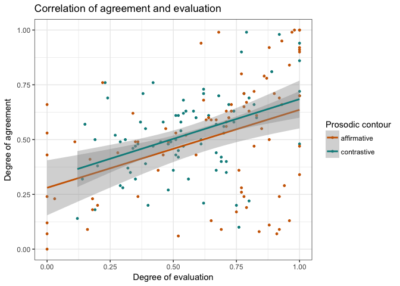

This model answers our first question, that is:

> Does variation in prosodic contour (from affirmative to contrastive) lead to a change in the utterances perceived agreement?

It would seem that the answer to this question is: Yes, but only when adjective polarity is taken into account. Indeed, adjective polarity on its own is a better predictor of perceived agreement, though the reason has not be explored.

However, there is more that should be explained. The predictability of each prosodic contour is not only related to agreement, but may also be related to **evaluation**, **friendliness** and **happiness**.

Below is a quick outline of these influences.

## Exploring other interactional meanings
### Evaluation

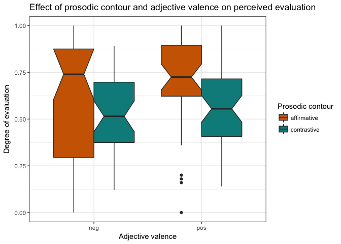

```
## Linear mixed model fit by maximum likelihood  ['lmerMod']
## Formula: like ~ cprosody * cadj_1_pole + cagree + cfriendly + chappy +  
##     (1 + cprosody | workerid) + (1 | adj_1)
##    Data: c_like_df
## 
##      AIC      BIC   logLik deviance df.resid 
##    -21.7     15.8     22.8    -45.7      156 
## 
## Scaled residuals: 
##      Min       1Q   Median       3Q      Max 
## -2.54564 -0.64005 -0.01616  0.65546  2.09740 
## 
## Random effects:
##  Groups   Name        Variance Std.Dev. Corr 
##  workerid (Intercept) 0.01510  0.1229        
##           cprosody    0.04997  0.2235   -1.00
##  adj_1    (Intercept) 0.00000  0.0000        
##  Residual             0.03309  0.1819        
## Number of obs: 168, groups:  workerid, 28; adj_1, 6
## 
## Fixed effects:
##                       Estimate Std. Error t value
## (Intercept)           0.592816   0.027168  21.820
## cprosody             -0.082515   0.051471  -1.603
## cadj_1_pole          -0.042403   0.032558  -1.302
## cagree                0.423459   0.077989   5.430
## cfriendly             0.257654   0.069477   3.708
## chappy                0.003428   0.071237   0.048
## cprosody:cadj_1_pole  0.041707   0.059987   0.695
## 
## Correlation of Fixed Effects:
##             (Intr) cprsdy cdj_1_ cagree cfrndl chappy
## cprosody    -0.701                                   
## cadj_1_pole  0.008 -0.061                            
## cagree      -0.008 -0.030 -0.289                     
## cfriendly   -0.005 -0.030 -0.246 -0.084              
## chappy       0.002  0.156 -0.018 -0.134 -0.419       
## cprsdy:c_1_ -0.053  0.000 -0.147  0.157  0.098 -0.042
```

### Friendliness
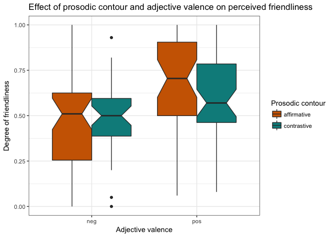

```
## Linear mixed model fit by maximum likelihood  ['lmerMod']
## Formula: friendly ~ cprosody * cadj_1_pole + cagree + clike + chappy +  
##     (1 + cprosody | workerid) + (1 | adj_1)
##    Data: c_friendly_df
## 
##      AIC      BIC   logLik deviance df.resid 
##     -9.2     28.3     16.6    -33.2      156 
## 
## Scaled residuals: 
##     Min      1Q  Median      3Q     Max 
## -2.8280 -0.4871  0.0467  0.5947  3.3140 
## 
## Random effects:
##  Groups   Name        Variance Std.Dev. Corr 
##  workerid (Intercept) 0.004774 0.06909       
##           cprosody    0.020010 0.14146  -0.69
##  adj_1    (Intercept) 0.000000 0.00000       
##  Residual             0.040687 0.20171       
## Number of obs: 168, groups:  workerid, 28; adj_1, 6
## 
## Fixed effects:
##                      Estimate Std. Error t value
## (Intercept)           0.56003    0.02037  27.488
## cprosody              0.04036    0.04251   0.949
## cadj_1_pole           0.11809    0.03446   3.426
## cagree               -0.04003    0.08749  -0.458
## clike                 0.21803    0.07461   2.922
## chappy                0.41333    0.06919   5.974
## cprosody:cadj_1_pole -0.09141    0.06542  -1.397
## 
## Correlation of Fixed Effects:
##             (Intr) cprsdy cdj_1_ cagree clike  chappy
## cprosody    -0.276                                   
## cadj_1_pole  0.006 -0.089                            
## cagree      -0.012 -0.093 -0.282                     
## clike        0.000  0.148  0.007 -0.385              
## chappy       0.002  0.194 -0.117 -0.135 -0.061       
## cprsdy:c_1_ -0.076 -0.003 -0.081  0.151  0.001 -0.022
```

### Happiness
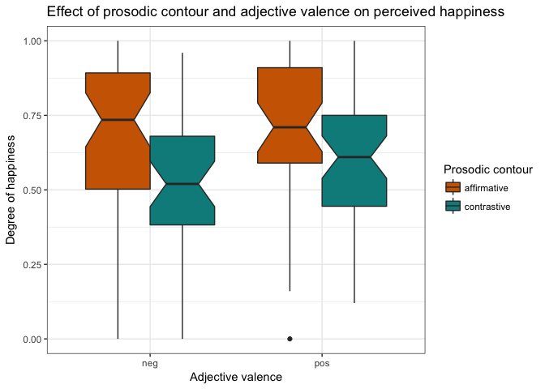

```
## Linear mixed model fit by maximum likelihood  ['lmerMod']
## Formula: happy ~ cprosody * cadj_1_pole + cagree + cfriendly + clike +  
##     (1 + cprosody | workerid) + (1 | adj_1)
##    Data: c_happy_df
## 
##      AIC      BIC   logLik deviance df.resid 
##     -5.1     32.4     14.6    -29.1      156 
## 
## Scaled residuals: 
##      Min       1Q   Median       3Q      Max 
## -2.84771 -0.50137  0.09033  0.64050  2.14812 
## 
## Random effects:
##  Groups   Name        Variance Std.Dev. Corr 
##  workerid (Intercept) 0.005679 0.07536       
##           cprosody    0.016387 0.12801  -0.69
##  adj_1    (Intercept) 0.000000 0.00000       
##  Residual             0.041846 0.20456       
## Number of obs: 168, groups:  workerid, 28; adj_1, 6
## 
## Fixed effects:
##                       Estimate Std. Error t value
## (Intercept)           0.616290   0.021317  28.910
## cprosody             -0.115580   0.040492  -2.854
## cadj_1_pole          -0.002951   0.036012  -0.082
## cagree                0.160982   0.088505   1.819
## cfriendly             0.420183   0.070996   5.918
## clike                -0.041817   0.077323  -0.541
## cprosody:cadj_1_pole  0.053303   0.066875   0.797
## 
## Correlation of Fixed Effects:
##             (Intr) cprsdy cdj_1_ cagree cfrndl clike 
## cprosody    -0.275                                   
## cadj_1_pole  0.008 -0.073                            
## cagree      -0.011 -0.072 -0.285                     
## cfriendly   -0.007  0.016 -0.278 -0.032              
## clike        0.002  0.163  0.058 -0.380 -0.219       
## cprsdy:c_1_ -0.075  0.003 -0.106  0.148  0.090 -0.021
```

## Summary of interactional meaning
We see that: 
+ both negative and positive adjectives are perceived as being evaluated more positively (being more liked) when uttered in an affirmative contour
+ negative adjectives have no influence on perceived friendliness, regardless of prosodic contour
+ positive adjectives are perceived as being more friendly in tone when uttered with affirmative prosody (or the speak is more friendly when she uses affirmative prosody on positive adjectives)
+ both negative and positive adjectives are perceived as being happier in tone when uttered with affirmative prosody (or the speak is more happy when she uses affirmative prosody)

These models, and indeed the main model capturing agreement, capture the important influences of interactional factors. This answers our second question:

> Does a contrastive prosodic contour indicate more than just disagreement, influencing other interactional meanings?

I would appear that this data shows that there are various interactional meanings at play when listeners hear contrastive prosodic contours.

# Discussion

Based on this pilot experiment I am able to, tentatively, answer the two questions set out in the introduction

1. Does variation in prosodic contour (from affirmative to contrastive) lead to a change in the utterances perceived agreement?
2. Does a contrastive prosodic contour indicate more than just disagreement, influencing other interactional meanings?

The results of this experiment do not support the assumption that contrastive contours necessarily index disagreement in interactions. Instead, it seems that contrastive contours, when in interaction with other social features, can indicate disagreement, though they may also map onto other social and interaction meanings. 

Contrastive contours also influence listener perception in other interesting ways. An examination of the qualitative assessments given by listeners showed that contrastive contours were consistently perceived as sarcastic or annoyed. In addition, the affirmative contours were often thought to sound bored, tired or even sad. It is clear listeners are pulling more than simply agreement and disagreement from variation in prosodic contour.

Though the predictions for agreement alone were not borne out, those for agreement's interaction with evaluation were. This reinforces my position in regards to prior assessments of contrastive contours, support their evaluation as overly simplistic. Social and interactional meanings are not created in isolation. Instead, various linguistic features operate together to create a social meaning, and various social meanings have important influences on one-another. These results reinforce the need for further work examining the phonetics of interactions, and the ways in which intonation influence listener's perception of social meaning.

# Select References

Boersma, P., & Weenink, D. (2011). Praat: doing phonetics by computer [Computer program]. Version 5.2.20. Retrieved from http://www.praat.org/
Dennison, Heeyeon, and Amy Schafer. (2010). Online construction of implicature through contrastive prosody. *Speech Prosody 2010* 100120:1-4.
DuBois, John. (2007). The stance triangle. (Stancetaking in Discourse: Subjectivity, Evaluation, Interaction*, ed. by Robert Englebretson, 139-182. Amsterdam: Benjamins.
Kurumada, Chiguasa, Meredith Brown, and Michael Tanenhaus. (2012). Pragmatic interpretation of contrastive prosody: It looks like speech adaptation. *The proceedings of the 35th annual meeting of the Cognitive Science Society*, Sapporo, Japan, August.
Ogden, Richard. (2006). Phonetics and social action in agreements and disagreements. *Journal of Pragmatics* 38: 1752-1775.

# Appendix
## Stimuli

###Critical Trials

Positive || Negative |
-|-|-|-
Cake || Ice cream	|
Speaker A	| That cake was good | Speaker A	| That ice cream was bad
Speaker B	| It was good | Speaker B	| It was bad
||||
Scarf || Movie |
Speaker A	| That scarf was cute	| Speaker A	| That movie was boring
Speaker B	| It was cute	| Speaker B	| It was boring
||||
Restaurant || Theatre	|
Speaker A	| That restaurant was cozy | Speaker A | That theatre was dreary
Speaker B	| It was cozy | Speaker B	| It was dreary

###Filler Trials

Positive || Negative |
-|-|-|-
Documentary || Coffee	|
Speaker A	| Wasn't that documentary fasc* | Speaker A	| Isn't this coffee bitter
Speaker B	| It was very cool | Speaker B	| It's very strong
||||
Smoothie || Book	|
Speaker A	| Was that smoothie refreshing | Speaker A | Was that book crummy
Speaker B	| It was great | Speaker B	| It was okay
||||
Song || Hat	|
Speaker A	| Isn't this song catchy | Speaker A | Isn't this hat ugly
Speaker B	| It's really good | Speaker B	| It's really bad
||||
Museum || Salad	|
Speaker A	| Isn't this museum classy | Speaker A | Wasn't that salad gross
Speaker B	| It's pretty classy | Speaker B	| It was pretty gross

\* Due to table restrictions the word *fascinating* could not fit

## Exclusion of subjects

Model including all subjects:

```
## Linear mixed model fit by maximum likelihood  ['lmerMod']
## Formula: agree ~ cprosody * cadj_1_pole + clike + cfriendly + chappy +  
##     (1 + cprosody | workerid) + (1 | adj_1)
##    Data: centered
## 
##      AIC      BIC   logLik deviance df.resid 
##    -67.3    -29.8     45.7    -91.3      156 
## 
## Scaled residuals: 
##      Min       1Q   Median       3Q      Max 
## -2.24974 -0.62198 -0.02567  0.66076  2.75479 
## 
## Random effects:
##  Groups   Name        Variance  Std.Dev. Corr 
##  workerid (Intercept) 0.0129910 0.11398       
##           cprosody    0.0054629 0.07391  -1.00
##  adj_1    (Intercept) 0.0006802 0.02608       
##  Residual             0.0262213 0.16193       
## Number of obs: 168, groups:  workerid, 28; adj_1, 6
## 
## Fixed effects:
##                        Estimate Std. Error t value
## (Intercept)           0.5172554  0.0271122  19.078
## cprosody              0.0444514  0.0300376   1.480
## cadj_1_pole           0.1130122  0.0343873   3.286
## clike                 0.3064922  0.0592855   5.170
## cfriendly             0.0008094  0.0628349   0.013
## chappy                0.1133536  0.0618056   1.834
## cprosody:cadj_1_pole -0.1247270  0.0540199  -2.309
## 
## Correlation of Fixed Effects:
##             (Intr) cprsdy cdj_1_ clike  cfrndl chappy
## cprosody    -0.370                                   
## cadj_1_pole  0.003 -0.090                            
## clike       -0.001  0.159 -0.058                     
## cfriendly   -0.005 -0.079 -0.213 -0.235              
## chappy       0.001  0.231 -0.029 -0.016 -0.391       
## cprsdy:c_1_ -0.047  0.012 -0.066  0.029  0.113 -0.012
```

Model excluding subject 27

```
## Linear mixed model fit by maximum likelihood  ['lmerMod']
## Formula: agree ~ cprosody * cadj_1_pole + clike + cfriendly + chappy +  
##     (1 + cprosody | workerid) + (1 | adj_1)
##    Data: final_centered
## 
##      AIC      BIC   logLik deviance df.resid 
##    -59.9    -22.9     42.0    -83.9      150 
## 
## Scaled residuals: 
##      Min       1Q   Median       3Q      Max 
## -2.21797 -0.62493 -0.06024  0.68410  2.69758 
## 
## Random effects:
##  Groups   Name        Variance  Std.Dev. Corr 
##  workerid (Intercept) 0.0134439 0.11595       
##           cprosody    0.0056152 0.07493  -1.00
##  adj_1    (Intercept) 0.0008461 0.02909       
##  Residual             0.0267743 0.16363       
## Number of obs: 162, groups:  workerid, 27; adj_1, 6
## 
## Fixed effects:
##                      Estimate Std. Error t value
## (Intercept)           0.51477    0.02838  18.136
## cprosody              0.04289    0.03082   1.392
## cadj_1_pole           0.11659    0.03642   3.201
## clike                 0.30384    0.06005   5.060
## cfriendly             0.01036    0.06446   0.161
## chappy                0.10568    0.06313   1.674
## cprosody:cadj_1_pole -0.12957    0.05547  -2.336
## 
## Correlation of Fixed Effects:
##             (Intr) cprsdy cdj_1_ clike  cfrndl chappy
## cprosody    -0.368                                   
## cadj_1_pole  0.002 -0.085                            
## clike       -0.001  0.161 -0.058                     
## cfriendly   -0.004 -0.072 -0.188 -0.234              
## chappy       0.000  0.217 -0.038 -0.017 -0.400       
## cprsdy:c_1_ -0.042  0.012 -0.058  0.031  0.095 -0.011
```

## Correlations in the data set

Upon exploration of the data, strong correlations between the various interactional meanings (agreement, evaluation, friendliness and happiness) were uncovered. Of prime influence on perceived agreement was evaluation

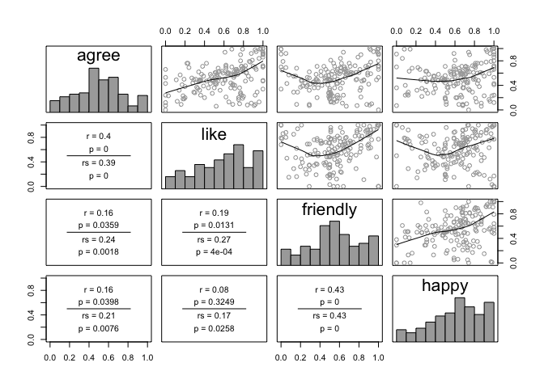

In order to take this into account, a model was instead fit to centred versions of each factor. Note: this is a replication of the model reported above.


```
## Linear mixed model fit by maximum likelihood  ['lmerMod']
## Formula: agree ~ cprosody * cadj_1_pole + clike + cfriendly + chappy +  
##     (1 + cprosody | workerid) + (1 | adj_1)
##    Data: centered
## 
##      AIC      BIC   logLik deviance df.resid 
##    -67.3    -29.8     45.7    -91.3      156 
## 
## Scaled residuals: 
##      Min       1Q   Median       3Q      Max 
## -2.24974 -0.62198 -0.02567  0.66076  2.75479 
## 
## Random effects:
##  Groups   Name        Variance  Std.Dev. Corr 
##  workerid (Intercept) 0.0129910 0.11398       
##           cprosody    0.0054629 0.07391  -1.00
##  adj_1    (Intercept) 0.0006802 0.02608       
##  Residual             0.0262213 0.16193       
## Number of obs: 168, groups:  workerid, 28; adj_1, 6
## 
## Fixed effects:
##                        Estimate Std. Error t value
## (Intercept)           0.5172554  0.0271122  19.078
## cprosody              0.0444514  0.0300376   1.480
## cadj_1_pole           0.1130122  0.0343873   3.286
## clike                 0.3064922  0.0592855   5.170
## cfriendly             0.0008094  0.0628349   0.013
## chappy                0.1133536  0.0618056   1.834
## cprosody:cadj_1_pole -0.1247270  0.0540199  -2.309
## 
## Correlation of Fixed Effects:
##             (Intr) cprsdy cdj_1_ clike  cfrndl chappy
## cprosody    -0.370                                   
## cadj_1_pole  0.003 -0.090                            
## clike       -0.001  0.159 -0.058                     
## cfriendly   -0.005 -0.079 -0.213 -0.235              
## chappy       0.001  0.231 -0.029 -0.016 -0.391       
## cprsdy:c_1_ -0.047  0.012 -0.066  0.029  0.113 -0.012
```

Additionally, another model was tests, this time fit to the centred prosody residuals, though the regular centred model better accounts for the data.

```
## Linear mixed model fit by maximum likelihood  ['lmerMod']
## Formula: agree ~ cprosody_residuals * cadj_1_pole + (1 | workerid) + (0 +  
##     cprosody_residuals | adj_1)
##    Data: centered
## 
##      AIC      BIC   logLik deviance df.resid 
##    -36.0    -14.2     25.0    -50.0      161 
## 
## Scaled residuals: 
##      Min       1Q   Median       3Q      Max 
## -2.18309 -0.67978  0.03445  0.68454  2.40503 
## 
## Random effects:
##  Groups   Name               Variance Std.Dev.
##  workerid (Intercept)        0.011615 0.10777 
##  adj_1    cprosody_residuals 0.001379 0.03713 
##  Residual                    0.035194 0.18760 
## Number of obs: 168, groups:  workerid, 28; adj_1, 6
## 
## Fixed effects:
##                                 Estimate Std. Error t value
## (Intercept)                     0.517415   0.025074  20.636
## cprosody_residuals              0.009248   0.019868   0.465
## cadj_1_pole                     0.145510   0.029234   4.977
## cprosody_residuals:cadj_1_pole -0.043561   0.040823  -1.067
## 
## Correlation of Fixed Effects:
##             (Intr) cprsd_ cdj_1_
## cprsdy_rsdl -0.001              
## cadj_1_pole  0.000 -0.074       
## cprsdy_:_1_ -0.047  0.000 -0.002
```

## Feedback
- Run model with separated adjective valence, to see if just the positive ones (like previous research) show the predicted effect for agreement (Ciyang)
- It makes sense that adjective valence (with and without * with prosody) should should affect agreement (Sebastian)
- Read Lassiter? paper about negating adjectives (based on polarity/valence) because of interaction (Ciyang)
- Look into similarities between contrastive and HRT (Robert)
- Look into effect of Speaker 1 intonation on the perception of Speaker 2 behaviour (Judith, and others)
- Include more variety of Speaker 2 voices (Robert)
